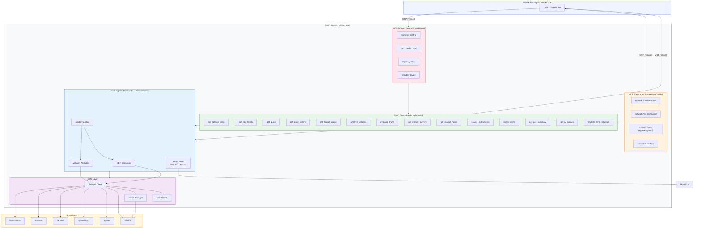
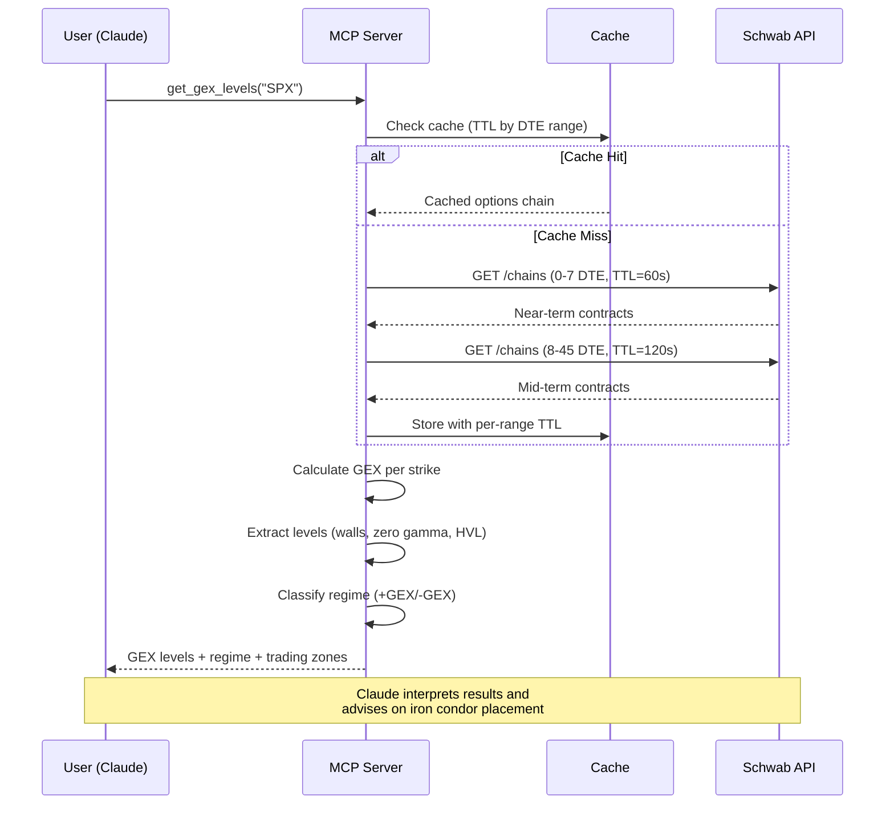
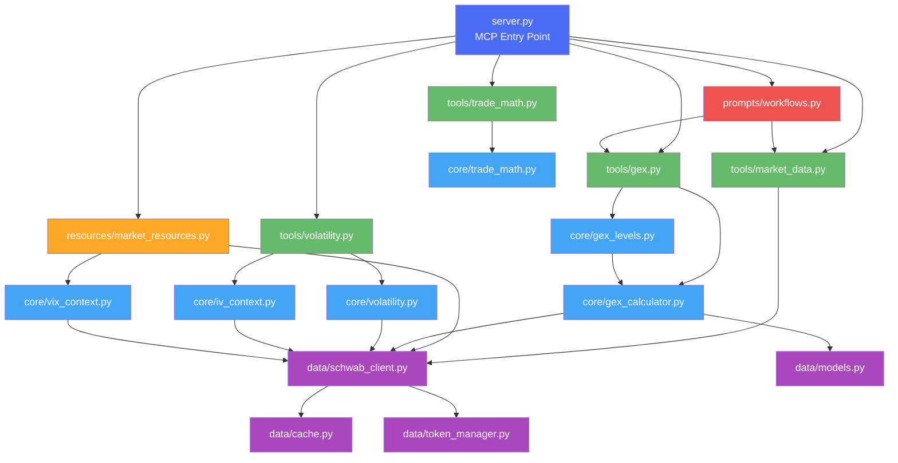
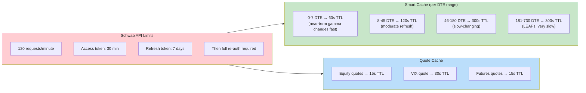
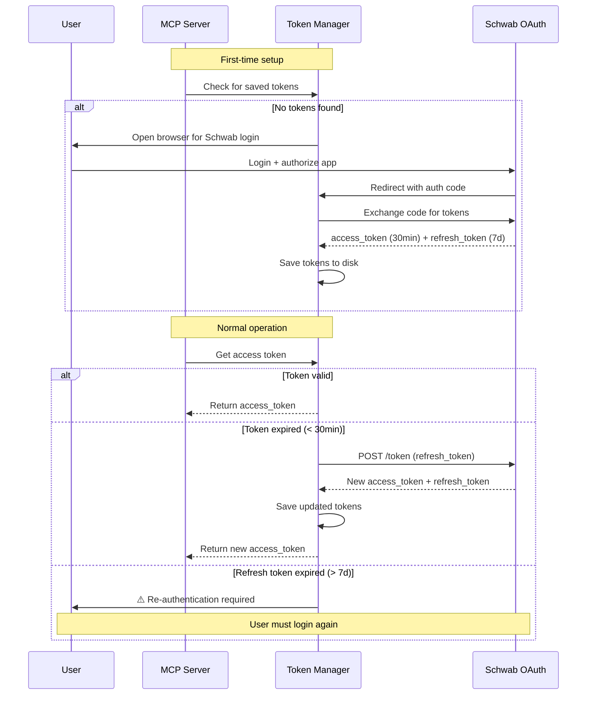
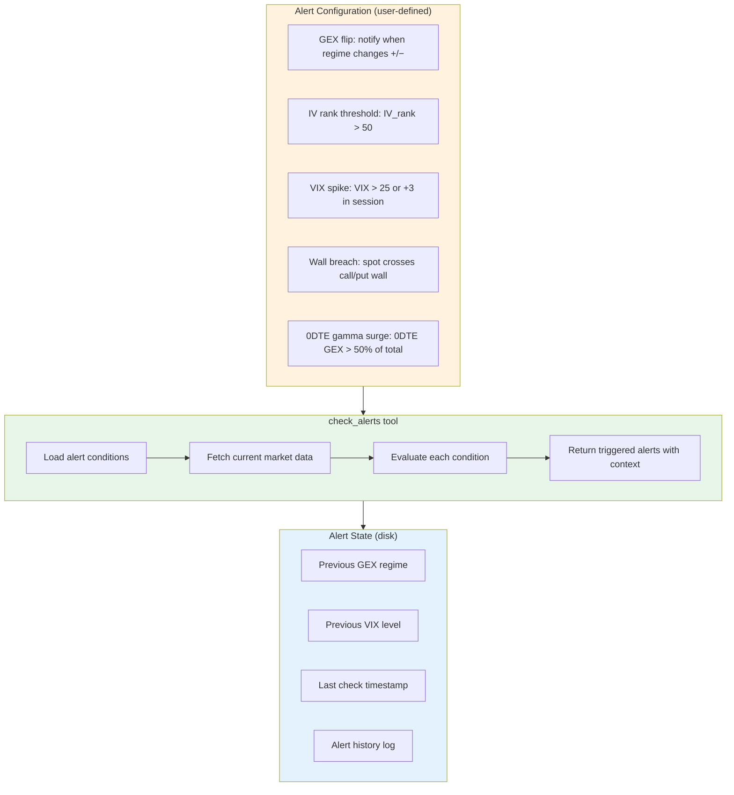
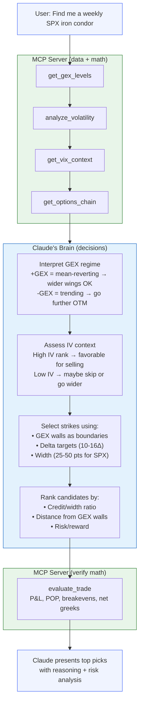

# Schwab Options MCP Server — Architecture

## Overview

A **Model Context Protocol (MCP) server** that gives Claude direct access to Charles Schwab market data and GEX (Gamma Exposure) analysis. Designed for **options premium selling** — weekly SPX iron condors, directional credit spreads, and intraday regime detection.

## Design Philosophy

**MCP = calculator. Claude = analyst.**

| MCP Server (deterministic) | Claude (judgment) |
|---|---|
| Fetch prices, chains, greeks from Schwab | Interpret what the data means for positioning |
| Compute GEX per strike across 500 strikes | Decide if +GEX regime favors selling premium today |
| Calculate POP via Black-Scholes integration | Choose which strikes to sell based on context |
| Rank IV percentile against 60-day history | Weigh tradeoffs between candidates |
| Check if VIX crossed a threshold (boolean) | Explain risk and recommend position sizing |

**Rule of thumb:** If the answer is the same every time given the same inputs → MCP. If it depends on context, experience, or tradeoffs → Claude.

The MCP never outputs opinions, recommendations, or interpretations. It returns numbers, labels (based on thresholds), and structured data. Claude does all the thinking.

```
┌─────────────────────────────────────────────────────────┐
│                     Claude Desktop                       │
│                                                         │
│  "What are the GEX levels for SPX?"                     │
│  "Find me an iron condor with 80% POP for Friday"       │
│  "Has the gamma regime flipped today?"                   │
└──────────────────────┬──────────────────────────────────┘
                       │ MCP Protocol (stdio)
                       ▼
┌─────────────────────────────────────────────────────────┐
│              Schwab Options MCP Server                   │
│                     (Python)                             │
│                                                         │
│  ┌─────────┐ ┌──────────┐ ┌───────────┐ ┌───────────┐  │
│  │  Tools  │ │Resources │ │  Prompts  │ │  Alerts   │  │
│  └────┬────┘ └────┬─────┘ └─────┬─────┘ └─────┬─────┘  │
│       │           │             │              │         │
│  ┌────▼───────────▼─────────────▼──────────────▼─────┐  │
│  │              Core Engine                           │  │
│  │  ┌──────────┐ ┌──────────┐ ┌────────────────────┐ │  │
│  │  │ GEX Calc │ │ Vol Anlz │ │ Trade Math         │ │  │
│  │  └──────────┘ └──────────┘ └────────────────────┘ │  │
│  └───────────────────────┬───────────────────────────┘  │
│                          │                               │
│  ┌───────────────────────▼───────────────────────────┐  │
│  │              Data Layer                            │  │
│  │  ┌──────────┐ ┌──────────┐ ┌────────────────────┐ │  │
│  │  │ Schwab   │ │  Cache   │ │ Token Manager      │ │  │
│  │  │ Client   │ │ (Disk)   │ │ (OAuth 2.0)        │ │  │
│  │  └──────────┘ └──────────┘ └────────────────────┘ │  │
│  └───────────────────────┬───────────────────────────┘  │
│                          │                               │
└──────────────────────────┼───────────────────────────────┘
                           │ HTTPS
                           ▼
              ┌──────────────────────┐
              │  Schwab Developer    │
              │  API (REST)          │
              │  api.schwabapi.com   │
              └──────────────────────┘
```

---

## System Architecture (Mermaid)



---

## Data Flow



---

## MCP Tools (What Claude Can Call)

### Market Data Tools

| Tool | Description | Schwab Endpoint |
|------|-------------|-----------------|
| `get_quote` | Real-time quote for any symbol (equity, ETF, index) | `GET /quotes` |
| `get_options_chain` | Full options chain with greeks, OI, volume | `GET /chains` |
| `get_price_history` | OHLCV candles (1min to monthly, up to 20yr) | `GET /pricehistory` |
| `get_futures_quote` | Quote for futures (/ES, /NQ, /CL, etc.) | `GET /quotes` |
| `get_market_movers` | Top movers by volume, trades, % change | `GET /movers/{index}` |
| `get_market_hours` | Market hours for equity/option/futures/forex | `GET /markets` |
| `search_instruments` | Search symbols by name, description, CUSIP | `GET /instruments` |
| `get_expiration_dates` | Available expiration dates for a symbol | `GET /expirationchain` |

### GEX & Analysis Tools

| Tool | Description | Computation |
|------|-------------|-------------|
| `get_gex_levels` | Key GEX levels: walls, zero gamma, HVL, max gamma, top 10 | GEX = \|Γ\| × OI × 100 × S² × 0.01 |
| `get_gex_summary` | Aggregate GEX metrics: total, gross, DEX, VEX, theta | Sum across all strikes |
| `get_0dte_levels` | Same-day expiration GEX levels only | Filter DTE=0, compute levels |
| `analyze_volatility` | IV skew (10d/25d/40d), butterfly, term structure, IV-RV | Options chain analytics |
| `get_iv_surface` | IV by strike and expiration (surface data) | Grid interpolation |
| `analyze_term_structure` | ATM IV across expirations, contango/backwardation | Per-expiry ATM IV |
| `get_vix_context` | VIX level, percentile, regime, VIX/VIX3M ratio | VIX quote + 1yr history |
| `estimate_charm_shift` | Project GEX shift N hours forward (time decay) | charm ≈ -θ/S |
| `estimate_vanna_shift` | Project GEX shift for IV change | vanna ≈ ν/S |

### Trade Math Tools (Pure Calculation — No Opinions)

| Tool | Description | Logic |
|------|-------------|-------|
| `evaluate_trade` | Calculate P&L, breakevens, POP, net greeks for a given trade | Options math only |
| `check_alerts` | Evaluate watchlist conditions (IV rank threshold, GEX flip, etc.) | Boolean condition checks |

**What Claude does (NOT the MCP):**
- Interpret GEX regime and decide what it means for positioning
- Choose iron condor strikes based on GEX levels + IV + VIX context
- Rank trade candidates and recommend the best one
- Assess risk and suggest position sizing
- Decide directional bias and timing

### MCP Resources (Ambient Context)

Resources provide **background context** that Claude can read without explicit tool calls:

| Resource URI | Description | Auto-refresh |
|---|---|---|
| `schwab://market-status` | Market open/closed, hours today, next open | On access |
| `schwab://vix-dashboard` | VIX level, regime, percentile, term structure | 60s cache |
| `schwab://gex-regime/{symbol}` | Current GEX regime, zero gamma level, flip status | 60s cache |
| `schwab://watchlist` | User-configured symbols with current quotes | 120s cache |

### MCP Prompts (Reusable Workflows)

| Prompt | Description | Tools Used |
|---|---|---|
| `morning_briefing` | Pre-market analysis: VIX, GEX levels, overnight moves, regime | vix_context + gex_levels + quotes |
| `iron_condor_scan` | Find optimal weekly SPX iron condors for current regime | gex_levels + find_iron_condors + volatility |
| `regime_check` | Quick regime assessment: are we in +GEX or -GEX? Trending or mean-reverting? | gex_levels + vix_context |
| `intraday_levels` | 0DTE levels + charm-adjusted projections for rest of day | 0dte_levels + charm_shift |

---

## GEX Calculation Pipeline

```mermaid
flowchart LR
    subgraph Input["Data Input"]
        OC[Options Chain<br/>from Schwab]
        SP[Spot Price]
    end

    subgraph Calc["Per-Strike Calculation"]
        direction TB
        F1["Call GEX = |Γ| × OI × 100 × S² × 0.01 × (+1)"]
        F2["Put GEX = |Γ| × OI × 100 × S² × 0.01 × (-1)"]
        F3["Net GEX = Call GEX + Put GEX"]
    end

    subgraph Levels["Level Extraction (0-45 DTE)"]
        direction TB
        L1[Call Wall — max call OI strike]
        L2[Put Wall — max put OI strike]
        L3[Zero Gamma — GEX sign flip<br/>linear interpolation]
        L4[Max Gamma — highest |GEX| strike]
        L5[HVL — highest total OI strike]
        L6[GEX 1-10 — top 10 by |GEX|]
    end

    subgraph Regime["Regime Classification"]
        direction TB
        R1{Spot vs Zero Gamma?}
        R2["+GEX Regime<br/>Mean-reverting<br/>Dealers dampen moves"]
        R3["-GEX Regime<br/>Trending<br/>Dealers amplify moves"]
    end

    OC --> Calc
    SP --> Calc
    F1 --> F3
    F2 --> F3
    Calc --> Levels
    Levels --> Regime
    R1 -->|Above| R2
    R1 -->|Below| R3

    style Input fill:#fff3e0
    style Calc fill:#e3f2fd
    style Levels fill:#e8f5e9
    style Regime fill:#fce4ec
```

---

## Project Structure

```
thinkorswim_local_mcp/
├── docs/
│   ├── ARCHITECTURE.md          # This file
│   ├── SCHWAB_API_REFERENCE.md  # API endpoints, limits, data fields
│   └── TOOLS_REFERENCE.md       # Detailed MCP tool specifications
│
├── src/
│   ├── server.py                # MCP server entry point (stdio transport)
│   │
│   ├── tools/                   # MCP tool handlers
│   │   ├── __init__.py
│   │   ├── market_data.py       # Quotes, chains, history, movers, hours
│   │   ├── gex.py               # GEX levels, summary, 0DTE, projections
│   │   ├── volatility.py        # IV analysis, skew, term structure, surface
│   │   └── trade_math.py        # Evaluate trade P&L/POP, alerts
│   │
│   ├── core/                    # Pure math & calculations (no opinions)
│   │   ├── __init__.py
│   │   ├── gex_calculator.py    # GEX formula, per-strike calc, aggregates
│   │   ├── gex_levels.py        # Level extraction, zero gamma, walls
│   │   ├── volatility.py        # IV skew, butterfly, term structure
│   │   ├── iv_context.py        # IV percentile, rank, realized vol
│   │   ├── vix_context.py       # VIX regime, percentile, term structure
│   │   └── trade_math.py        # POP calculation, P&L math, breakevens
│   │
│   ├── data/                    # Data access layer
│   │   ├── __init__.py
│   │   ├── schwab_client.py     # Schwab API wrapper (schwab-py)
│   │   ├── cache.py             # Disk cache with per-range TTL
│   │   ├── models.py            # Data models (OptionContract, Chain, etc.)
│   │   └── token_manager.py     # OAuth 2.0 token lifecycle
│   │
│   ├── resources/               # MCP resource handlers
│   │   ├── __init__.py
│   │   └── market_resources.py  # Market status, VIX dashboard, watchlist
│   │
│   └── prompts/                 # MCP prompt templates
│       ├── __init__.py
│       └── workflows.py         # morning_briefing, iron_condor_scan, etc.
│
├── tests/
│   ├── test_gex_calculator.py
│   ├── test_gex_levels.py
│   ├── test_schwab_client.py
│   └── test_tools.py
│
├── .env.example                 # Configuration template
├── pyproject.toml               # Python package config
├── requirements.txt             # Dependencies
└── README.md
```

---

## Module Dependency Graph



---

## Schwab API Rate Limits & Caching Strategy



**Budget at 120 req/min:**
- Full SPX chain fetch (4 DTE ranges) = 4 requests
- VIX + VIX3M quotes = 2 requests
- SPX underlying quote = 1 request
- Total per full refresh = ~7 requests
- Comfortable headroom for additional symbols and ad-hoc queries

---

## Authentication Flow



---

## Alert System Design

Since MCP servers are **request-driven** (not persistent daemons), alerts work as a **condition evaluation engine**:



**How it works in practice:**
1. User tells Claude: *"Watch SPX for a GEX flip or if VIX spikes above 25"*
2. Claude calls `check_alerts` — conditions are saved to disk
3. Each time user chats with Claude, the `morning_briefing` prompt or manual `check_alerts` evaluates conditions
4. Claude reports: *"Alert: SPX GEX flipped negative at 11:42 AM. Zero gamma now at 5,180. Consider tightening your short strikes."*

---

## Iron Condor Workflow — Claude as the Brain

The MCP provides data and math. **Claude makes all the decisions.**



---

## Technology Stack

| Component | Choice | Rationale |
|---|---|---|
| **Language** | Python 3.11+ | MCP SDK support, your existing GEX tool is Python |
| **MCP SDK** | `mcp` (official Python SDK) | First-party, stable, stdio transport |
| **Schwab Client** | `schwab-py` | Most mature Python wrapper, auto token refresh |
| **Cache** | `diskcache` | Same as gex-tool, fast, reliable |
| **Data Models** | `pydantic` | Validation, serialization, type safety |
| **Math** | `numpy` | GEX calculations, interpolation |
| **Testing** | `pytest` | Standard, mock-friendly |
| **Config** | `.env` + `python-dotenv` | Simple, proven pattern from gex-tool |

### Dependencies

```
mcp>=1.0.0
schwab-py>=1.0.0
pydantic>=2.0
numpy>=1.24
diskcache>=5.6
python-dotenv>=1.0
httpx>=0.24
```

---

## Configuration

```env
# Schwab API Credentials
SCHWAB_APP_KEY=your_app_key
SCHWAB_APP_SECRET=your_app_secret
SCHWAB_CALLBACK_URL=https://127.0.0.1:8182

# Token Storage
TOKEN_PATH=./tokens/schwab_tokens.json

# Default Settings
DEFAULT_SYMBOL=SPX
MAX_DTE=730
GEX_LEVEL_MAX_DTE=45

# Cache Settings
CACHE_DIRECTORY=./cache
DTE_RANGES=0-7,8-45,46-180,181-730
DTE_RANGE_CACHE_TTLS=60,120,300,300
QUOTE_CACHE_TTL=15

# Alert State
ALERT_STATE_PATH=./state/alerts.json
```

---

## Claude Desktop Integration

Add to `claude_desktop_config.json`:

```json
{
  "mcpServers": {
    "schwab-options": {
      "command": "python",
      "args": ["-m", "src.server"],
      "cwd": "/path/to/thinkorswim_local_mcp",
      "env": {
        "SCHWAB_APP_KEY": "your_key",
        "SCHWAB_APP_SECRET": "your_secret"
      }
    }
  }
}
```

---

## What Gets Ported from gex-tool-thinkorswim

| gex-tool Module | MCP Module | What Changes |
|---|---|---|
| `src/gex/calculator.py` | `src/core/gex_calculator.py` | Minimal — core math stays the same |
| `src/gex/levels.py` | `src/core/gex_levels.py` | Minimal — level extraction logic stays |
| `src/levels/extractor.py` | `src/core/gex_levels.py` | Merged into single module |
| `src/gex/volatility.py` | `src/core/volatility.py` | Minimal |
| `src/gex/iv_context.py` | `src/core/iv_context.py` | Minimal |
| `src/data/vix_context.py` | `src/core/vix_context.py` | Minimal |
| `src/data/schwab_fetcher.py` | `src/data/schwab_client.py` | Refactored to use schwab-py |
| `src/data/cache_manager.py` | `src/data/cache.py` | Same pattern, simplified |
| `src/data/data_models.py` | `src/data/models.py` | Pydantic v2 models |
| `src/web/strategy.py` | **Removed** | Claude handles all strategy/decisions directly |
| `src/web/app.py` | **Removed** | MCP replaces the web dashboard |
| `src/export/` | **Removed** | Claude formats output directly |
| `src/auth/` | `src/data/token_manager.py` | Simplified, schwab-py handles most of it |

---

## Phase Plan

### Phase 1 — Foundation
- Project setup (pyproject.toml, deps, structure)
- Token manager + Schwab client with caching
- Basic MCP server with `get_quote` and `get_options_chain` tools
- Test with Claude Desktop

### Phase 2 — GEX Engine
- Port GEX calculator from gex-tool
- Port level extraction (walls, zero gamma, HVL, max gamma)
- `get_gex_levels`, `get_gex_summary`, `get_0dte_levels` tools
- Charm/vanna projection tools

### Phase 3 — Volatility & Context
- Port IV analysis (skew, term structure, IV-RV)
- Port VIX context
- `analyze_volatility`, `get_vix_context`, `get_iv_surface` tools
- MCP resources (market status, VIX dashboard, GEX regime)

### Phase 4 — Trade Math & Alerts
- Trade evaluator: POP calculation, max profit/loss, breakevens, net greeks
- Alert condition engine (boolean checks, state persistence)
- No strategy/recommendation logic — Claude handles all decisions

### Phase 5 — Prompts & Polish
- MCP prompts (morning briefing, iron condor scan, regime check)
- Futures and futures options support
- Error handling hardening
- Documentation and tests
