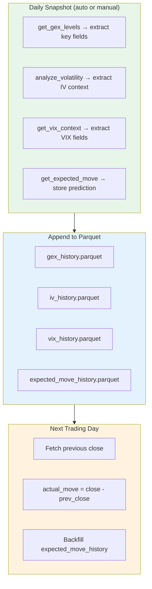

# Phase 3B — Historical Snapshots

**Goal:** Daily snapshots of GEX, IV, VIX, and expected move so Claude can see trends, streaks, and compare predictions vs reality.

**Depends on:** Phase 2 (GEX engine), Phase 3 (Volatility/VIX)

## What Gets Stored

One row per day per symbol. Compact — not full chains.

| Data | Fields | Size |
|---|---|---|
| **GEX snapshot** | regime, zero_gamma, call_wall, put_wall, max_gamma, hvl, total_gex, gross_gex | ~1KB/day |
| **IV context** | atm_iv, iv_percentile, iv_rank, realized_vol_20d, iv_rv_premium, skew_25d, skew_regime, term_structure_shape | ~500B/day |
| **VIX context** | vix_level, vix_percentile, vix_regime, vix3m, vix_vix3m_ratio, term_structure | ~300B/day |
| **Expected move** | expiration, expected_move_straddle, expected_move_1sd, actual_move (filled next day) | ~200B/day |

**Total:** ~2KB/day per symbol. 1 year of SPX = ~730KB. Negligible.

## Storage Format

Parquet files — same as gex-tool's `snapshot_store.py`.

```
data/snapshots/
├── SPX/
│   ├── gex_history.parquet
│   ├── iv_history.parquet
│   ├── vix_history.parquet
│   └── expected_move_history.parquet
├── QQQ/
│   └── ...
└── metadata.json              # Last snapshot timestamp per symbol
```

**Why Parquet:**
- Columnar — fast reads for "give me 30 days of zero_gamma"
- Compressed — smaller than CSV/JSON
- Already used in gex-tool
- Append-friendly via pyarrow

## Files to Create

```
src/
├── tools/
│   └── history.py               # History tool handlers
│
├── core/
│   └── snapshot_store.py        # Save/load/query Parquet snapshots
```

## Snapshot Lifecycle



## When Snapshots Are Taken

**Option A — Auto on first query of the day:**
When Claude calls any GEX/IV/VIX tool and no snapshot exists for today, automatically save one. Zero manual effort.

**Option B — Explicit tool call:**
`take_snapshot(symbol)` — Claude or user triggers it.

**Recommended: Option A** with Option B as override. Claude doesn't need to think about snapshotting — it just happens.

## Tool Specifications

### `get_gex_history`
```python
# Parameters
symbol: str = "SPX"
days: int = 30

# Returns
{
    "symbol": "SPX",
    "days": 30,
    "snapshots": [
        {
            "date": "2025-03-25",
            "regime": "positive",
            "zero_gamma": 5180.0,
            "call_wall": 5300.0,
            "put_wall": 5100.0,
            "max_gamma": 5250.0,
            "hvl": 5250.0,
            "total_gex": 450000000
        },
        ...
    ],
    "regime_streak": {
        "type": "positive",
        "days": 8
    },
    "zero_gamma_trend": {
        "direction": "rising",
        "change_5d": 35.0,
        "min_30d": 5080.0,
        "max_30d": 5200.0
    },
    "wall_movement": {
        "call_wall_5d_change": 20.0,
        "put_wall_5d_change": 30.0
    }
}
```

### `get_iv_history`
```python
# Parameters
symbol: str = "SPX"
days: int = 30

# Returns
{
    "symbol": "SPX",
    "days": 30,
    "snapshots": [
        {
            "date": "2025-03-25",
            "atm_iv": 14.5,
            "iv_percentile": 35,
            "iv_rank": 0.28,
            "realized_vol_20d": 12.8,
            "iv_rv_premium": 1.7,
            "skew_25d": 4.2,
            "skew_regime": "normal",
            "term_structure": "contango"
        },
        ...
    ],
    "iv_trend": {
        "direction": "rising",
        "change_5d": 2.1,
        "min_30d": 11.8,
        "max_30d": 18.2
    },
    "current_vs_history": {
        "iv_percentile": 35,
        "days_above_current": 19,
        "days_below_current": 11
    }
}
```

### `get_vix_history`
```python
# Parameters
days: int = 30

# Returns
{
    "days": 30,
    "snapshots": [
        {
            "date": "2025-03-25",
            "vix": 18.5,
            "vix_percentile": 42,
            "vix_regime": "moderate",
            "vix3m": 19.2,
            "vix_vix3m_ratio": 0.96,
            "term_structure": "contango"
        },
        ...
    ],
    "regime_history": {
        "days_low": 8,
        "days_moderate": 15,
        "days_elevated": 5,
        "days_spike": 2
    },
    "backwardation_events": [
        {"date": "2025-03-10", "ratio": 1.08, "duration_days": 2}
    ]
}
```

### `get_expected_move_history`
```python
# Parameters
symbol: str = "SPX"
days: int = 30

# Returns
{
    "symbol": "SPX",
    "days": 30,
    "snapshots": [
        {
            "date": "2025-03-21",
            "expiration": "2025-03-21",
            "expected_move": 55.0,
            "actual_move": 80.0,
            "exceeded": true,
            "ratio": 1.45          # actual / expected
        },
        ...
    ],
    "accuracy": {
        "times_exceeded": 8,       # actual > expected
        "times_within": 22,        # actual <= expected
        "exceed_rate": 0.27,       # 27% of the time
        "avg_ratio": 0.82,         # on average, actual is 82% of expected
        "max_ratio": 1.85          # worst miss
    }
}
```

### `take_snapshot`
```python
# Parameters
symbol: str = "SPX"

# Returns
{
    "symbol": "SPX",
    "date": "2025-03-26",
    "status": "saved",             # or "already_exists"
    "snapshot": { ... }            # the data that was saved
}
```

## Port from gex-tool

| Source | Target | Notes |
|---|---|---|
| `src/data/snapshot_store.py` | `src/core/snapshot_store.py` | Simplify — we only need daily granularity |

## Pre-Aggregated Fields

The history tools return pre-computed trends so Claude doesn't have to scan raw data:

| Field | Computation |
|---|---|
| `regime_streak` | Count consecutive days of same GEX regime |
| `zero_gamma_trend` | Direction + magnitude of zero gamma movement over 5d |
| `wall_movement` | How much call/put walls shifted in 5d |
| `iv_trend` | Direction + change in ATM IV over 5d |
| `regime_history` | Count of days in each VIX regime over period |
| `backwardation_events` | Dates when VIX/VIX3M went into backwardation |
| `exceed_rate` | How often actual move exceeded expected move |

These are all deterministic calculations — MCP territory.

## Dependencies

```
pyarrow>=14.0    # Parquet read/write
```

## Definition of Done

- [ ] Daily snapshots auto-save on first query of the day
- [ ] `get_gex_history("SPX", 30)` returns 30 days with regime streak and trends
- [ ] `get_iv_history("SPX", 30)` returns 30 days with IV trend
- [ ] `get_vix_history(30)` returns 30 days with regime breakdown
- [ ] `get_expected_move_history("SPX", 30)` returns accuracy stats
- [ ] `take_snapshot("SPX")` manually triggers a snapshot
- [ ] Expected move actual values are backfilled next trading day
- [ ] Parquet files are append-only (no data loss)
- [ ] Old snapshots (1yr+) can accumulate without performance issues
